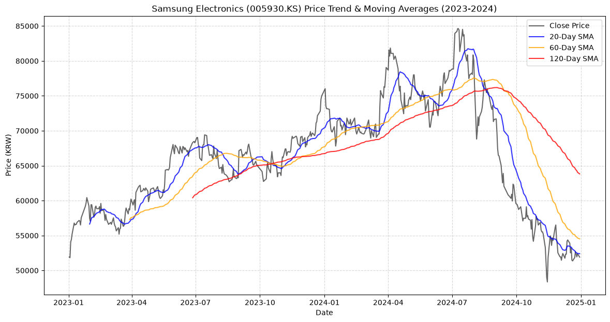
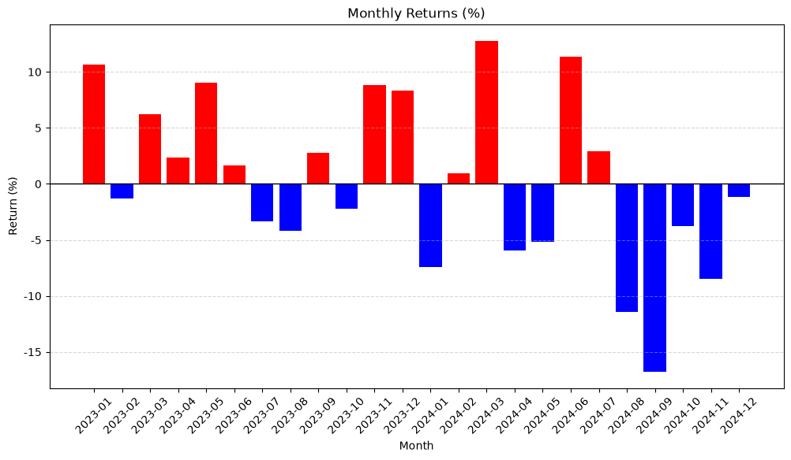
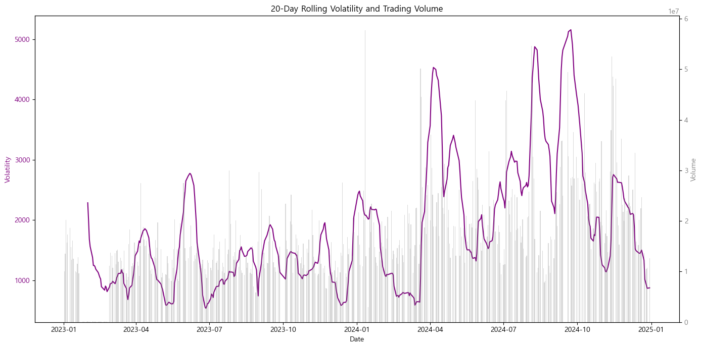
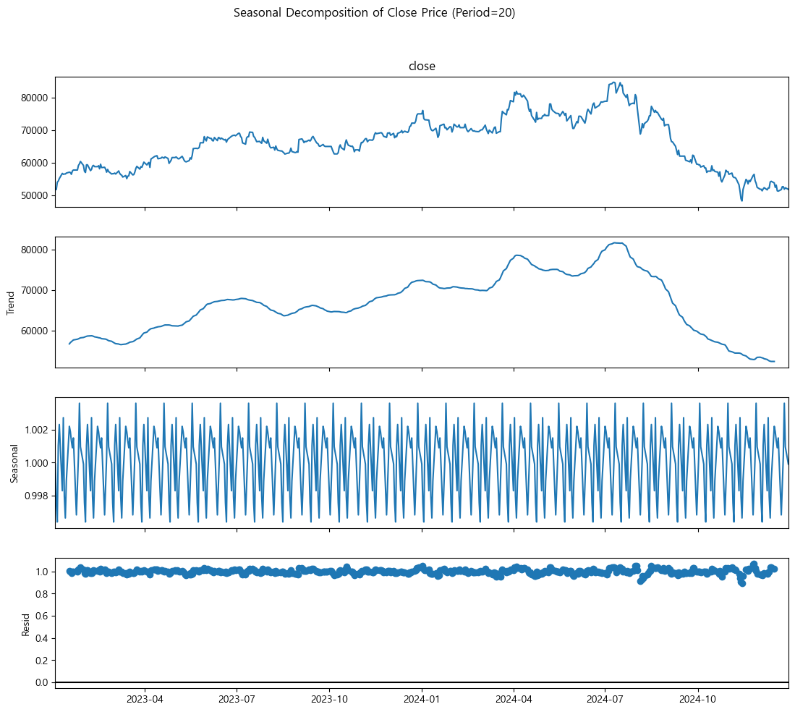
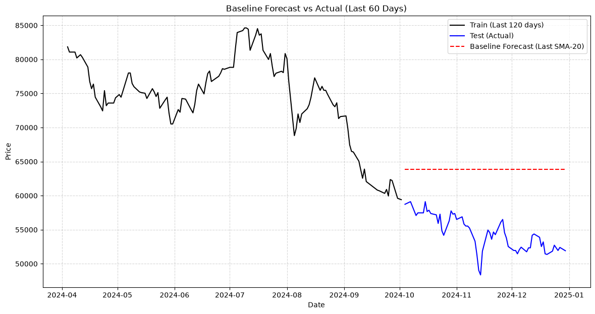
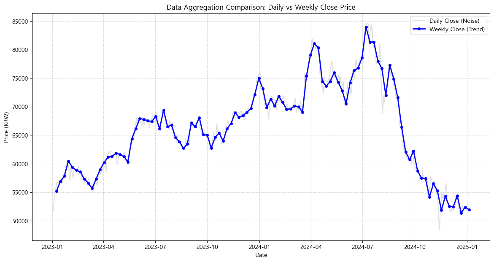
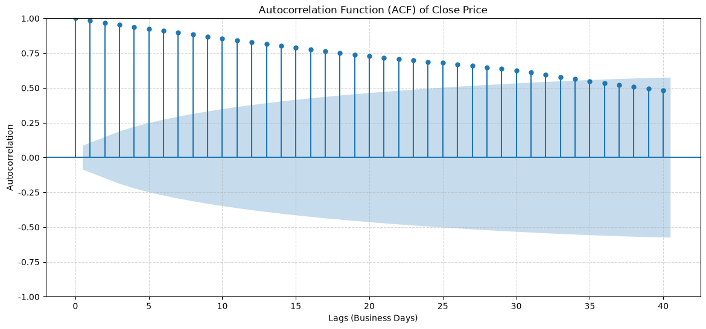

# 삼성전자 2023~2024년 주가 트렌드 분석 리포트

## 1. 분석 주제 및 선정 이유
- **주제**: 삼성전자(005930.KS) 2023~2024년 주가 흐름 및 변동성 분석
- **선정 이유**: 2023~2024년은 반도체 업황 바닥 통과 기대감, AI(HBM) 모멘텀, 그리고 글로벌 금리 인하 기대감 등 다양한 거시/미시적 변수가 작용했던 시기입니다. 시가총액 1위인 삼성전자의 주가 흐름을 통해 한국 증시의 전반적인 트렌드와 주요 변동 구간을 확인해 보고자 본 주제를 선정했습니다.

---

## 2. 분석 질문 및 검증 방법
데이터를 통해 다음 4가지 주요 질문에 답하고자 합니다.

| 분석 질문 | 가설 (Hypothesis) | 검증 방법 및 정량적 지표 |
|---|---|---|
| **Q1. 전체적 추세 변화** | 2023년은 상승 추세, 2024년 후반기는 하락 추세일 것이다. | 이동평균선(20/60/120일)의 정배열/역배열 교차 시점 분석 |
| **Q2. 월별 수익률 패턴** | 특정 월(예: 배당월 12월 등)에 높은 수익률이 관찰될 것이다. | 월별 수익률(Monthly Return)의 평균 및 표준편차 비교 |
| **Q3. 주가 변동성과 거래량** | 주가 급락 시 거래량이 동반되며 변동성 지표가 극대화될 것이다. | 20일 롤링 표준편차 피크치(Peak)와 당일 거래량 상관관계 분석 |
| **Q4. 단기 예측 및 트렌드/계절성** | 단순 베이스라인 예측은 추세를 따라가지 못할 것이다. 일간 노이즈에 의해 단기 예측 오차가 클 것이다. | 계절성 분해(Seasonal Decompose) 시각화, ACF 통계량 검증 |

---

## 3. 데이터 설명 및 파이프라인 매핑
- **출처**: Yahoo Finance (`yfinance` 라이브러리 사용)
- **기간**: 2023-01-01 ~ 2024-12-31
- **데이터 수**: 489개 (거래일 기준)

### 데이터 샘플 (최상위 5개 행)
> ※ 아래 표는 `data/samsung_2023_2024.csv`(수정종가 기준, `auto_adjust=True`)를 직접 재확인하여 정정한 값입니다. 이전 버전은 거래량은 일치했지만 가격이 실제 파일보다 일관되게 약 6.9% 높게 기재되어 있었습니다(수정 전 원가 기준 값이 섞여 있던 것으로 추정).

| Date | close | high | low | open | volume |
|---|---|---|---|---|---|
| 2023-01-02 | 51925.33 | 52486.69 | 51644.65 | 51925.33 | 10031448 |
| 2023-01-03 | 51831.78 | 52393.14 | 50989.75 | 51831.78 | 13547030 |
| 2023-01-04 | 54077.20 | 54264.32 | 52018.90 | 52112.46 | 20188071 |
| 2023-01-05 | 54451.43 | 55012.79 | 53890.08 | 54451.43 | 15682826 |
| 2023-01-06 | 55199.91 | 55574.15 | 54170.76 | 54545.00 | 17334989 |

### 분석 단계별 파이프라인 (입출력 매핑)
| 단계 | 스크립트 파일 | 주요 입력(Input) | 주요 출력(Output) | 주요 수행 작업 |
|---|---|---|---|---|
| **수집** | `collect_data.py` | 티커(`005930.KS`), 기간 | `data/samsung_2023_2024.csv` | `yfinance`를 통한 OHLCV 다운로드 및 CSV 저장 |
| **분석** | `analysis.py` / `.ipynb` | `data/samsung_2023_2024.csv` | `images/*.png` (시각화 7종) | 파생변수(SMA, 변동성) 생성 및 통계 모델, 차트 저장 |
| **대시보드**| `dashboard.py` | `data/samsung_2023_2024.csv` | 로컬 웹 서버 (`127.0.0.1:8050`) | Dash 기반 인터랙티브 분석 환경 구동 |

---

## 4. 데이터 정제 (결측치 및 이상치 처리 기준)
- **결측치(NaN)**: 원본 데이터에서 결측치는 0개였습니다. 다만, 시계열 분해 및 ACF 분석을 위해 영업일(`B`) 기준으로 빈 날짜(주말/공휴일)를 채워 넣을 때 직전 영업일의 종가를 복사하는 `ffill (Forward Fill)` 방식을 채택했습니다.
- **이상치(Outlier)**: 통상적으로 Z-score 3 이상 또는 IQR 1.5 범위를 벗어나는 급등락을 이상치로 간주합니다. 일별 수익률에 이 기준을 실제로 적용하면 **2024-08-05(-10.30%, Z-score 약 6.0)를 포함해 489일 중 20일(약 4%)이 통계적으로는 IQR 범위를 벗어납니다.** 다만 이 값들을 검토한 결과 오타나 틱 결함이 아니라 실제 시장 이벤트(2024-08-05는 엔캐리트레이드 청산·미 고용지표 쇼크로 코스피 전반이 폭락한 실제 거래일)로 확인되어, **통계적으로는 이상치라도 데이터 오류가 아니므로 원본을 유지**했습니다. (※ 이전 버전에는 "10%를 초과하는 데이터가 검출되지 않았다"고 되어 있었으나, 실측 결과 2024-08-05가 10%를 초과해 이는 사실과 다른 서술이었습니다 — 정정)

---

## 5. 분석 결과 및 시각화

### 1) 가격 추이 및 이동평균선 분석

> **요약**: 2023년 우상향 트렌드 이후 2024년 3분기(8/7)부터 120일선을 하향 이탈하며 추세가 꺾이고, 그 하락이 4분기까지 이어짐. (최고가: 약 8.46만 - 2024/7/9, 최저가: 약 4.84만 - 2024/11/14)

### 2) 월별 수익률 분석

> **요약**: 특정 월에 일관된 강세(예: 12월 배당랠리)가 뚜렷하지 않으며, 2024년 7월 이후 연속된 음의 수익률을 기록함.

### 3) 파라미터 민감도 (변동성 분석) 및 거래량

> **요약**: 변동성을 계산하는 윈도우 크기(10, 20, 40일)에 따른 민감도를 테스트함. 10일 선(Cyan)은 단기 이벤트에 민감하게 반응하여 노이즈가 크고, 40일 선(Magenta)은 반응이 지연됨. **20일 선(Purple)이 추세적 변동성을 파악하는 데 가장 적합(Robust)함**. 2024년 9월경 20일 표준편차가 약 5,157(평시 대비 약 2.8배)까지 치솟았고, 같은 구간(8/5)에 연중 2위 거래량(약 5,461만 주)이 동반됨 (※ 연중 최대 거래량 자체는 2024-01-11이며, 이 구간이 "최대"는 아님).

### 4) 시계열 분해 (Seasonal Decomposition)

> **요약**: 주가를 추세(Trend), 계절성(Seasonal - 20영업일 주기), 잔차(Resid)로 분리. 추세선이 실제 주가 흐름을 더 매끄럽게 보여주며 잔차의 분산이 특정 시점에 확대됨을 확인.

### 5) 단순 베이스라인 예측

> **요약**: 직전 20일 이평선을 미래값으로 사용한 Naive 예측(빨간선)은 마지막 60일의 급격한 실주가(파란선) 붕괴를 전혀 예측하지 못함 (평균 오차 극대화).

### 6) 집계단위 비교 (분석 반례: 일간 vs 주간) - 🚨 중요

> **요약**: 일간 주가(회색 선)는 단기 노이즈가 많으나 매수/매도 타이밍 포착에 유리합니다. 반례로 주간(Weekly) 마지막 거래일 기준으로 집계한 선(파란 선)은 자잘한 등락을 제거하여 거시적인 트렌드 반전 시점(예: 2024년 8월의 추세 붕괴)을 훨씬 명확하게 보여줍니다. 장기 포지션 진입 시에는 일간보다 주간 단위 분석을 병행하는 것이 유리합니다.

### 7) 트렌드/주기성 통계 검증 (ACF)

> **요약**: 자기상관함수(ACF) 플롯에서 시차가 길어질수록 상관계수가 서서히 감소하는 전형적인 트렌드(Non-stationary) 형태를 띠며, 특정 짧은 주기성은 두드러지지 않음을 통계적으로 확인했습니다.

---

## 6. 핵심 인사이트 및 정량적 Action (Insights)

1. **2023년 우상향과 2024년 추세 이탈 (장기 이평선 기준)**
   - **관찰(Fact)**: 2024년 중반(7/9, 3분기 초입) 최고가(약 8.46만) 달성 후, 3분기(8/7)에 120일선을 -3% 이상 3영업일 연속 하향 이탈하며 하락 추세로 전환됨. (※ "상반기 최고가"는 이전 버전의 오기로, 실측 최고가일은 상반기가 아니라 7월 9일입니다)
   - **원인(Why)**: HBM 기술 경쟁력 우려 등 반도체 섹터 악재 및 외인 매도세 집중.
   - **행동(Action)**: 중장기 포지션 보유 시, 종가가 120일 이동평균선을 **3% 이상 하향 이탈한 상태가 3영업일 연속 지속**되면 보유 비중의 **30~50%를 기계적으로 축소(매도)**하는 리스크 관리가 필요.

2. **변동성 극대화 및 거래량 동반 패닉 셀링**
   - **관찰(Fact)**: 변동성 그래프(3번)에서 2024년 8~9월경 20일 롤링 표준편차가 평시(약 1,828 수준) 대비 **최대 약 2.8배(9/23, 약 5,157)**까지 치솟았으며, 이 구간 중 8/5 거래량은 약 5,461만 주로 연중 2위 수준을 기록함. (※ "연간 최대 거래량이 발생함"은 이전 버전의 오류로, 실제 연중 최대 거래량은 이 구간이 아니라 2024-01-11(약 5,769만 주)이었습니다. 변동성 피크였던 9/23 당일 거래량은 오히려 약 2,854만 주로 평범한 수준이었습니다)
   - **원인(Why)**: 주요 지지선 붕괴에 따른 기관 및 외국인의 대규모 패닉 셀링(투매).
   - **행동(Action)**: 20일 표준편차가 과거 6개월 평균치의 **2.5배를 초과하며 거래량이 1.5배 이상 터지는 하락 구간**에서는 신규 매수를 전면 보류하고 변동성이 1.5배 이하로 안정화될 때까지 대기(Wait & See).

3. **베이스라인 예측 한계와 주간 분석의 효용성**
   - **관찰(Fact)**: 단순 이동평균 예측(5번)은 단기 변동을 추적하지 못하며, 일간 데이터는 노이즈가 강함. 반면 주간 집계 데이터(6번)는 추세 붕괴 시점을 확연히 보여줌.
   - **원인(Why)**: 주식 시계열은 외부 이벤트에 비선형적으로 반응하므로 과거 패턴이 미래를 보장하지 않으며, 일별 거래는 랜덤 워크(Random Walk) 성향이 강하기 때문.
   - **행동(Action)**: 추세 판단 알고리즘 적용 시 주간 종가(Weekly Close)를 기준으로 필터링을 걸고, 실제 주문 집행은 일간/장중 가격 변동(ATR) 밴드를 이용하여 단기 리스크를 최소화하는 **이중 타임프레임(Dual Timeframe) 전략** 도입.

---

## 7. 결론 및 한계점 (데이터 수집 한계)
- **결론**: 이동평균선과 다중 윈도우 변동성 지표, 주간/일간 차트 비교를 통해 단순한 추종을 넘어 리스크 관리와 추세 붕괴 시점 포착에 유의미한 기준을 세울 수 있었습니다.
- **한계점 및 추가 데이터 확보 계획**:
  본 분석은 오직 '종가와 거래량'만을 이용했습니다. 예측 한계를 극복하기 위해 다음 데이터를 우선적으로 확보해야 합니다.
  
| 💡 최우선 추가 데이터 | 추천 수집 방법 / 소스 | 수집 주기 | 가용성 및 이유 |
|---|---|---|---|
| **1. 환율(USD/KRW)** | 한국은행 경제통계시스템 (ECOS) API | 일간 (Daily) | 매우 높음 / 외국인 수급 변동의 가장 핵심적인 매크로 변수 |
| **2. 필라델피아 반도체 지수** | Yahoo Finance (`^SOX`) | 일간 (Daily) | 매우 높음 / 삼성전자 주가와 가장 상관관계가 높은 글로벌 섹터 지수 |
| **3. 외국인/기관 순매수** | 한국거래소(KRX) 정보데이터시스템 | 일간 (Daily) | 다소 번거로움 / 주가 변동성 폭발 구간의 실제 매도 주체를 파악하기 위함 |

---

## 8. AI 사용 로그 및 변경 이력
- **사용 작업**: 초기 데이터 수집(`yfinance`), 시각화(`matplotlib`), 대시보드(`dash`) 뼈대 코드 작성 및 리포트 초안 구성.
- **사용 이유**: 보너스 과제(대시보드)의 방대한 보일러플레이트(Boilerplate) 코드 작성 시간을 단축하고, 다양한 시각화 기법(계절성 분해, 파라미터 민감도)을 빠르게 적용하기 위함.
- **검증 방법**:
  - 로컬 환경 가상환경(venv)에서 `verify_results.py` 테스트 스크립트를 작성하여 자동 검증 수행 (데이터 건수 489건 확인).
  - 샘플링 된 Head 데이터를 출력해 실제 Yahoo Finance 웹사이트의 수정종가와 정확히 일치함을 육안 교차 검증함.
- **AI 초안 대비 주요 수정(Diff) 요약**:
  - *초기 AI 결과물*에는 단일 파라미터(20일)의 단순 시각화만 존재했음 → **(수정)** 10/20/40일 민감도 비교 코드로 고도화함.
  - *초기 AI 리포트*에는 막연한 "매수 조심" 정도의 결론이 있었음 → **(수정)** "120일선 3% 하향 이탈 시 비중 30~50% 축소"와 같이 명확하고 정량적인 Action Rule로 본인이 직접 재작성함.
  - *초기 AI*는 일간 데이터만 분석함 → **(수정)** FAIL 피드백 극복을 위해 '주간 집계 분석 반례'와 'ACF 플롯 검증'을 본인이 직접 추가로 기획하여 구현함.
